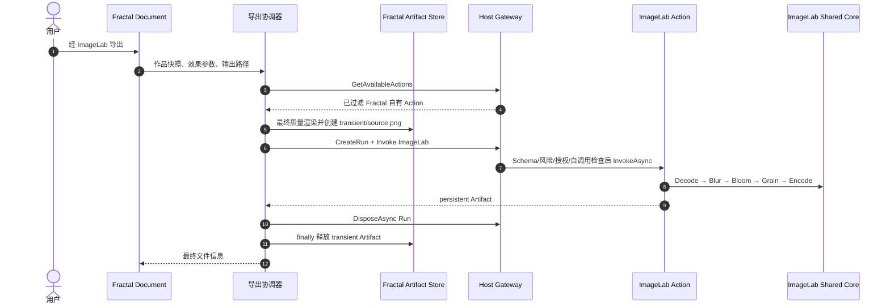
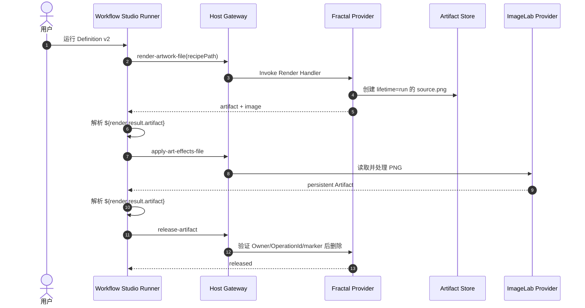

# G0007 实现说明

## SOLID 边界

```text
FractalArtworkDocument
  → IImageLabArtEffectExportCoordinator（用例协调）
    → IFractalWorkflowArtifactStore（所有权与物化）
    → IImageLabActionClient（Gateway Adapter）

RenderArtworkFileWorkflowActionHandler
  → IWorkflowRecipeFiles
  → IFractalWorkflowArtifactStore

ReleaseArtifactWorkflowActionHandler
  → IFractalWorkflowArtifactStore
```

Document 只保存会话级效果表单和触发命令。效果参数不进入 ArtworkSnapshot v6，不影响 Dirty、Undo/Redo；
原“导出 PNG”仍输出未处理作品。Handler 不依赖 Gateway，所以不会形成嵌套 Action。

Artifact Store 是 Scoped，因为最终质量导出管线属于 Document/Invocation Scope。插件加载清理由无渲染依赖的
Lifecycle 调用静态文件恢复入口，避免根容器捕获 Scoped 服务；每次创建 Artifact 前也执行同一清理。

配方文件为 `*.fractal-workflow.json`，根版本为 1、上限 4 MiB，作品正文复用 ArtworkSnapshot v6。Codec
严格拒绝未知根字段、重复字段、缺失字段和未知版本。

Release 成功时输出 `{ "released": true }`；发生普通占用时输出非空 `warningCode`。现有冻结 Schema Profile
要求每个节点只有一个字符串 `type`，因此没有使用 `string | null` 联合类型，也没有修改协议。

## Art 内调用时序



ImageLab 不可用的检查发生在保存对话框、渲染和临时文件创建之前。`IImageLabActionClient` 的 `await using`
确保 Run 完全退出后协调器才删除输入。

## Studio 编排时序



Studio 是顶层 Consumer；Fractal Render Handler 不调用 ImageLab。三个步骤因此符合 Host 的 Handler 嵌套禁令。
